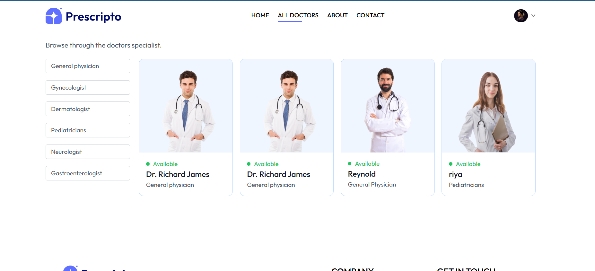
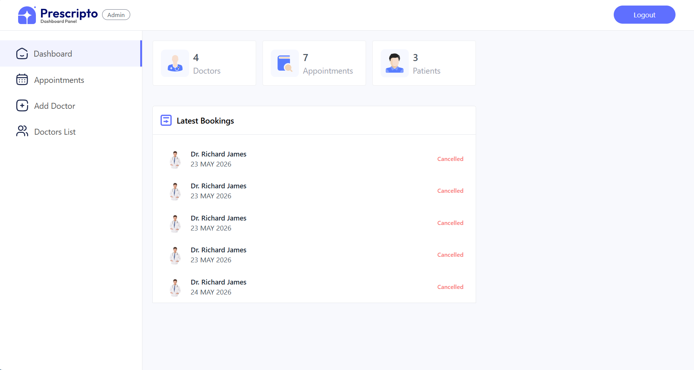
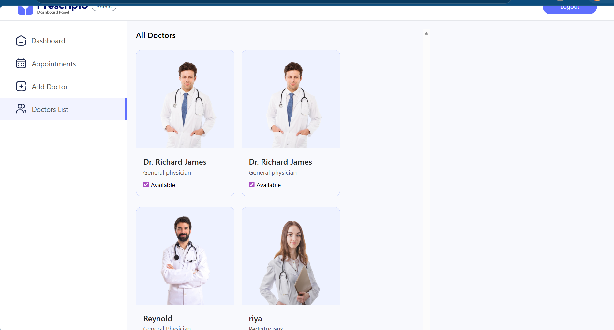

# Prescripto - Doctor Appointment Booking Platform

Prescripto is a full-stack doctor appointment booking system built for patients, doctors, and administrators. It lets patients discover doctors by speciality, book appointments, manage their profile, and pay online. Doctors get their own panel to track appointments and update profile details, while admins can manage doctors, monitor bookings, and keep the platform organized from a dedicated dashboard.

The project is split into three working parts:

- `frontend_practo` - the patient-facing website
- `admin` - the admin and doctor dashboard panel
- `Backend_practo` - the Express and MongoDB API server

## Why This Project Exists

Healthcare booking apps look simple from the outside, but they need a lot of moving pieces to work well: authentication, doctor availability, appointment slots, cancellation flows, dashboards, and payments. This project brings those parts together in one practical MERN-style application.

It is designed as a real product flow rather than just a static UI. A patient can browse doctors, book a slot, see the booking in their appointments page, and pay using Razorpay. Admins and doctors can then manage those same records from their own panels.

## Screenshots

### Patient Home Page

The home page introduces the product clearly and gives patients a direct path to start booking. The speciality section is visible right below the hero so users can move from discovery to action quickly.


### Browse by Speciality and Top Doctors

Patients can browse doctors by speciality and quickly scan available doctors. The layout keeps the selection simple, with large doctor cards and readable speciality labels.


### All Doctors Page

The all-doctors page includes a speciality filter on the left and doctor cards on the right. This helps patients narrow down the list without losing context.



### Admin Dashboard

The admin dashboard gives a quick view of platform activity: total doctors, appointments, patients, and the latest bookings. It is built for quick checking rather than deep navigation.



### Admin Doctors List

Admins can view doctors and toggle availability from the doctors list. This is useful when a doctor needs to be temporarily hidden from patient booking.



## Main Features

### Patient Website

- Browse doctors by speciality
- View doctor details and availability
- Book appointments by date and time slot
- View personal appointments
- Cancel appointments
- Pay online with Razorpay
- Register, login, and manage profile details

### Admin Panel

- Secure admin login
- Dashboard with doctors, appointments, patients, and latest bookings
- Add new doctors with image, speciality, fees, address, and profile details
- View all doctors
- Toggle doctor availability
- View and manage all appointments
- Cancel appointments when needed

### Doctor Panel

- Secure doctor login
- Doctor dashboard with earnings, appointments, and patient count
- View assigned appointments
- Mark appointments as completed
- Cancel appointments
- View and update profile details
- Update availability, fees, and address

## Tech Stack

### Frontend

- React
- Vite
- Tailwind CSS
- React Router
- Axios
- React Toastify

### Backend

- Node.js
- Express
- MongoDB
- Mongoose
- JWT authentication
- Multer
- Cloudinary
- Razorpay

## Project Structure

```text
practo_project/
  Backend_practo/
    config/
    controller/
    middleware/
    models/
    routes/
    server.js

  frontend_practo/
    src/
      assets/
      components/
      context/
      pages/

  admin/
    src/
      assets/
      components/
      context/
      pages/
        Admin/
        Doctor/

  docs/
    screenshots/
```

## Getting Started

### 1. Clone the Repository

```bash
git clone https://github.com/rajkumar0932/Doctor_Appointment_Website.git
cd Doctor_Appointment_Website
```

### 2. Install Backend Dependencies

```bash
cd Backend_practo
npm install
```

Create `Backend_practo/.env`:

```env
MONGODB_URI=your_mongodb_connection_string
CLOUDINARY_NAME=your_cloudinary_name
CLOUDINARY_API_KEY=your_cloudinary_api_key
CLOUDINARY_SECRET_KEY=your_cloudinary_secret
ADMIN_EMAIL=admin@example.com
ADMIN_PASSWORD=your_admin_password
JWT_SECRET_KEY=your_jwt_secret
RAZORPAY_KEY_ID=your_razorpay_key_id
RAZORPAY_KEY_SECRET=your_razorpay_key_secret
CURRENCY=INR
```

Start the backend:

```bash
npm run server
```

### 3. Install Patient Frontend Dependencies

```bash
cd ../frontend_practo
npm install
```

Create `frontend_practo/.env`:

```env
VITE_BACKEND_URL=http://localhost:4000
VITE_RAZORPAY_KEY_ID=your_razorpay_key_id
```

Run the patient website:

```bash
npm run dev
```

### 4. Install Admin Panel Dependencies

```bash
cd ../admin
npm install
```

Create `admin/.env`:

```env
VITE_BACKEND_URL=http://localhost:4000
```

Run the admin and doctor panel:

```bash
npm run dev
```

## API Overview

### User Routes

- `POST /api/user/register`
- `POST /api/user/login`
- `GET /api/user/get-profile`
- `POST /api/user/update-profile`
- `POST /api/user/book-appointment`
- `GET /api/user/appointments`
- `POST /api/user/cancel-appointment`
- `POST /api/user/payment-razorpay`
- `POST /api/user/verify-razorpay`

### Admin Routes

- `POST /api/admin/login`
- `POST /api/admin/add-doctor`
- `GET /api/admin/all-doctors`
- `POST /api/admin/change-availablity`
- `GET /api/admin/appointments`
- `POST /api/admin/cancel-appointment`
- `GET /api/admin/dashboard`

### Doctor Routes

- `POST /api/doctor/login`
- `GET /api/doctor/list`
- `GET /api/doctor/appointments`
- `POST /api/doctor/cancel-appointment`
- `POST /api/doctor/complete-appointment`
- `GET /api/doctor/dashboard`
- `GET /api/doctor/profile`
- `POST /api/doctor/update-profile`

## Notes

- Environment files are intentionally ignored and should not be committed.
- Razorpay is configured in test mode through the key values you provide.
- Cloudinary is used for doctor and user image uploads.
- Admin and doctor panels share the same React app inside the `admin` folder, but they use different auth tokens and routes.

## Current Status

The core appointment flow is working across patient, admin, and doctor panels. The app now includes dashboards, doctor management, appointment management, profile updates, and Razorpay payment order creation and verification.
